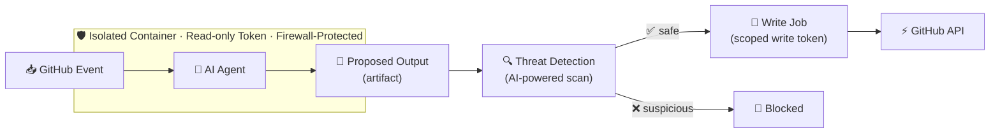

import { Card, CardGrid } from '@astrojs/starlight/components';
import FeatureCard from '../../components/FeatureCard.astro';
import FeatureGrid from '../../components/FeatureGrid.astro';
import Video from '../../components/Video.astro';
import BlogLinkSection from '../../components/BlogLinkSection.astro';

Imagine a world where improvements to your repositories are automatically delivered each morning, ready for you to review. Issues are automatically triaged, CI failures analyzed, documentation maintained and tests improved. All defined via simple markdown files.

GitHub Agentic Workflows deliver this: repository automation, running the coding agents you know and love, in GitHub Actions, with strong guardrails and security-first design principles.

Use GitHub Copilot, Claude by Anthropic or OpenAI Codex for event-triggered and scheduled jobs to improve your repository. GitHub Agentic Workflows [augment](https://github.github.com/gh-aw/reference/faq/#determinism) your existing, deterministic CI/CD with [Continuous AI](https://githubnext.com/projects/continuous-ai) capabilities.

Developed by GitHub Next and Microsoft Research, workflows run with added guardrails, using safe outputs and sandboxed execution to help keep your repository safe.

> ⓘ Note: GitHub Agentic Workflows is in early development and may change significantly. Using agentic workflows requires careful attention to security considerations and careful human supervision, and even then things can still go wrong. Use it with caution, and at your own risk.

## By the Numbers

| Metric | Value |
|--------|-------|
| Supported AI engines | 4 (GitHub Copilot, Claude, OpenAI Codex, custom) |
| Security layers | 5 (read-only token, zero secrets, network firewall, safe outputs, threat detection) |
| Design patterns | 18+ (IssueOps, ChatOps, DailyOps, BatchOps, and more) |
| Supported GitHub event triggers | 10+ (issues, pull_request, push, schedule, discussion, label, …) |
| Safe output types | 8+ (create-issue, create-pull-request, add-comment, add-label, …) |
| Installation | 1 command: `gh extension install github/gh-aw` |

## Key Features

<FeatureGrid columns={3}>
  <FeatureCard icon="pencil" title="Automated Markdown Workflows" href="/gh-aw/introduction/overview/#natural-language-to-github-actions">
    Write automation in markdown instead of complex YAML
  </FeatureCard>
  <FeatureCard icon="cpu" title="AI-Powered Decision Making" href="/gh-aw/introduction/how-they-work/">
    Workflows that understand context and adapt to situations
  </FeatureCard>
  <FeatureCard icon="mark-github" title="GitHub Integration" href="/gh-aw/reference/github-tools/">
    Deep integration with Actions, Issues, PRs, Discussions, and repository management
  </FeatureCard>
  <FeatureCard icon="shield-lock" title="Safety First" href="/gh-aw/introduction/architecture/">
    Sandboxed execution with minimal permissions and safe output processing
  </FeatureCard>
  <FeatureCard icon="beaker" title="Multiple AI Engines" href="/gh-aw/reference/engines/">
    Support for Copilot, Claude, Codex, and custom AI processors
  </FeatureCard>
  <FeatureCard icon="workflow" title="Continuous AI" href="/gh-aw/introduction/how-they-work/">
    Systematic, automated application of AI to software collaboration
  </FeatureCard>
</FeatureGrid>

## Guardrails Built-In

AI agents can be manipulated into taking unintended actions—through malicious repository content, compromised tools, or prompt injection. GitHub Agentic Workflows addresses this with five security layers that work together to contain the impact of a confused or compromised agent.

### Read-only tokens

The AI agent receives a GitHub token scoped to read-only permissions. Even if the agent attempts to create a pull request, push code, or delete a file, the underlying token simply doesn't allow it. The agent can observe your repository; it cannot change it.

### Zero secrets in the agent

The agent process never receives write tokens, API keys, or other sensitive credentials. Those secrets exist only in separate, isolated jobs that run _after_ the agent has finished and its output has passed review. A compromised agent has nothing to steal and no credentials to misuse.

### Containerized with a network firewall

The agent runs inside an isolated container. A built-in network firewall—the [Agent Workflow Firewall](/gh-aw/introduction/architecture/#agent-workflow-firewall-awf)—routes all outbound traffic through a Squid proxy enforcing an explicit domain allowlist. Traffic to any other destination is dropped at the kernel level, so a compromised agent cannot exfiltrate data or call out to unexpected servers.

### Safe outputs with strong guardrails

The agent cannot write to GitHub directly. Instead, it produces a structured artifact describing its intended actions—for example, "create an issue with this title and body." A separate job with [scoped write permissions](/gh-aw/reference/safe-outputs/) reads that artifact and applies only what your workflow explicitly permits: hard limits per operation (such as a maximum of one issue per run), required title prefixes, and label constraints. The agent requests; a gated job decides.

### Agentic threat detection

Before any output is applied, a dedicated [threat detection job](/gh-aw/reference/threat-detection/) runs an AI-powered scan of the agent's proposed changes. It checks for prompt injection attacks, leaked credentials, and malicious code patterns. If anything looks suspicious, the workflow fails immediately and nothing is written to your repository.



See the [Security Architecture](/gh-aw/introduction/architecture/) for a full breakdown of the layered defense-in-depth model.

## Example: Daily Issues Report

Here's a simple workflow that runs daily to create an upbeat status report:

```markdown
---
on:
  schedule: daily
permissions:
  contents: read
  issues: read
  pull-requests: read
safe-outputs:
  create-issue:
    title-prefix: "[team-status] "
    labels: [report, daily-status]
    close-older-issues: true
---

## Daily Issues Report

Create an upbeat daily status report for the team as a GitHub issue.

## What to include

- Recent repository activity (issues, PRs, discussions, releases, code changes)
- Progress tracking, goal reminders and highlights
- Project status and recommendations
- Actionable next steps for maintainers

```

The `gh aw` cli augments this with a [lock file](/gh-aw/reference/faq/#what-is-a-workflow-lock-file) for a GitHub Actions Workflow (.lock.yml) that runs an AI agent (Copilot, Claude, Codex, ...) in a containerized environment on a schedule or manually.

The AI coding agent reads your repository context, analyzes issues, generates visualizations, and creates reports. All defined in natural language rather than complex code.

<BlogLinkSection
  href="https://github.blog/ai-and-ml/automate-repository-tasks-with-github-agentic-workflows/"
  mainText="Learn More on the GitHub Blog"
  subText="Automate repository tasks with GitHub Agentic Workflows"
/>

## Gallery

<FeatureGrid columns={3}>
  <FeatureCard icon="issue-opened" title="Issue & PR Management" href="/gh-aw/blog/2026-01-13-meet-the-workflows-issue-management/">
    Automated triage, labeling, and project coordination
  </FeatureCard>
  <FeatureCard icon="book" title="Continuous Documentation" href="/gh-aw/blog/2026-01-13-meet-the-workflows-documentation/">
    Continuous documentation maintenance and consistency
  </FeatureCard>
  <FeatureCard icon="code-review" title="Continuous Improvement" href="/gh-aw/blog/2026-01-13-meet-the-workflows-continuous-simplicity/">
    Daily code simplification, refactoring, and style improvements
  </FeatureCard>
  <FeatureCard icon="pulse" title="Metrics & Analytics" href="/gh-aw/blog/2026-01-13-meet-the-workflows-metrics-analytics/">
    Daily reports, trend analysis, and workflow health monitoring
  </FeatureCard>
  <FeatureCard icon="tools" title="Quality & Testing" href="/gh-aw/blog/2026-01-13-meet-the-workflows-quality-hygiene/">
    CI failure diagnosis, test improvements, and quality checks
  </FeatureCard>
  <FeatureCard icon="repo" title="Multi-Repository" href="/gh-aw/examples/multi-repo/">
    Feature sync and cross-repo tracking workflows
  </FeatureCard>
</FeatureGrid>

## Getting Started

Install the extension, add a sample workflow, and trigger your first run - all from the command line in minutes.

<Video
  src="/gh-aw/videos/install-and-add-workflow-in-cli.mp4"
  title="Install and add workflow in CLI demo video"
  captionsSrc="/gh-aw/videos/install-and-add-workflow-in-cli.vtt"
  aspectRatio="16:9"
/>

## Creating Workflows

Create custom agentic workflows directly from the GitHub web interface using natural language.

<Video
  src="/gh-aw/videos/create-workflow-on-github.mp4"
  title="Create workflow on GitHub demo video"
  captionsSrc="/gh-aw/videos/create-workflow-on-github.vtt"
  aspectRatio="16:9"
/>

## Built on GitHub Agentic Workflows

> [!TIP]
> **[Autoloop](https://githubnext.com/projects/autoloop/)** is a project by GitHub Next that builds on GitHub Agentic Workflows. Define a goal, a set of files the agent may modify, and an evaluation command that outputs a numeric metric — Autoloop runs on a schedule, proposes changes, and keeps only the ones that improve the metric. It's a way to continuously optimize any measurable aspect of your repository: test coverage, bundle size, build times, or custom research objectives. [View on GitHub](https://github.com/githubnext/autoloop)
